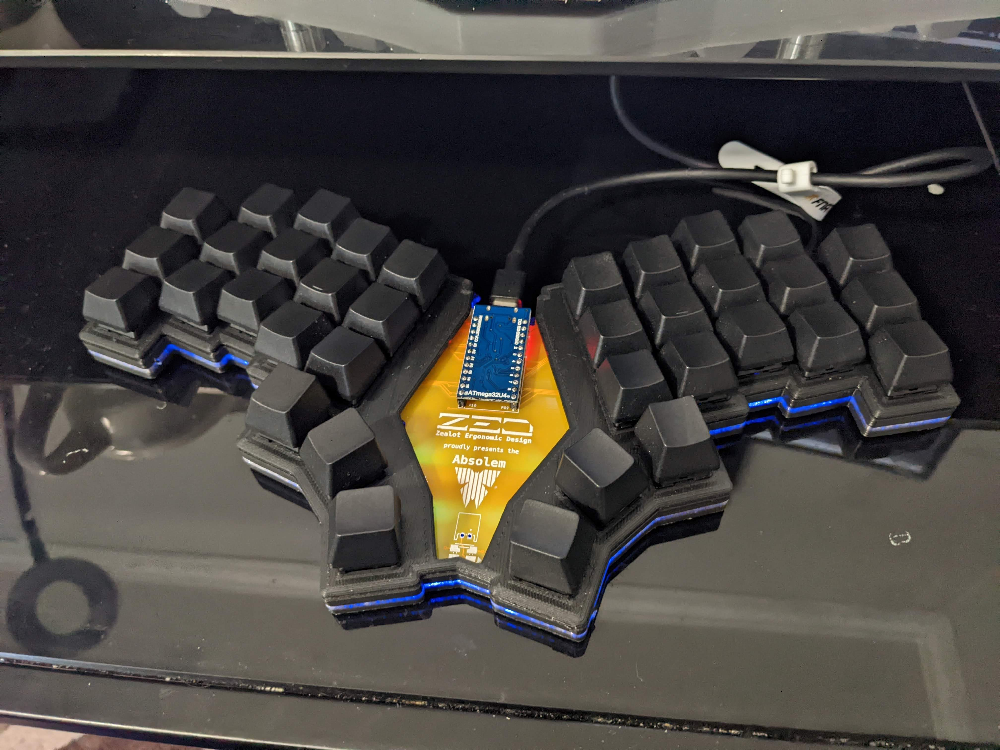
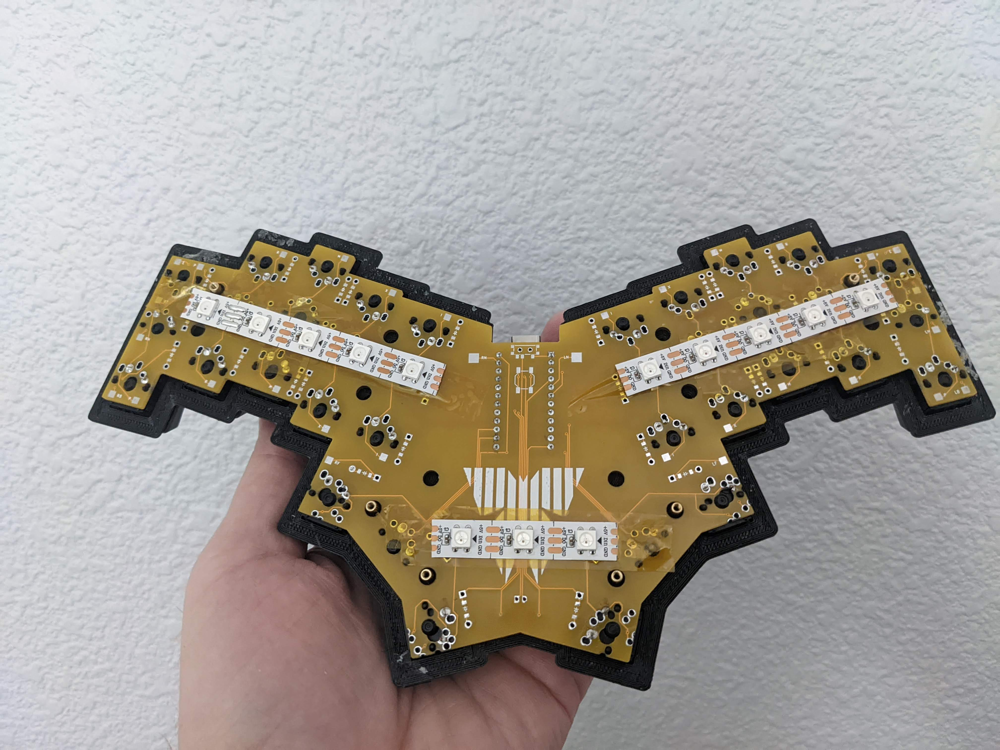
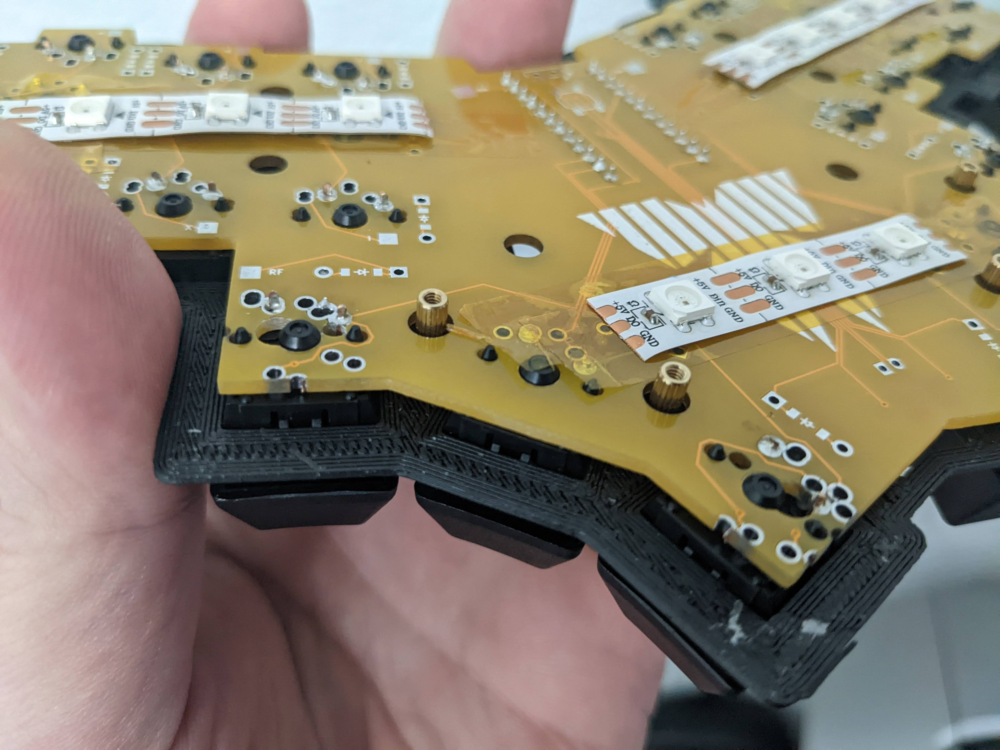
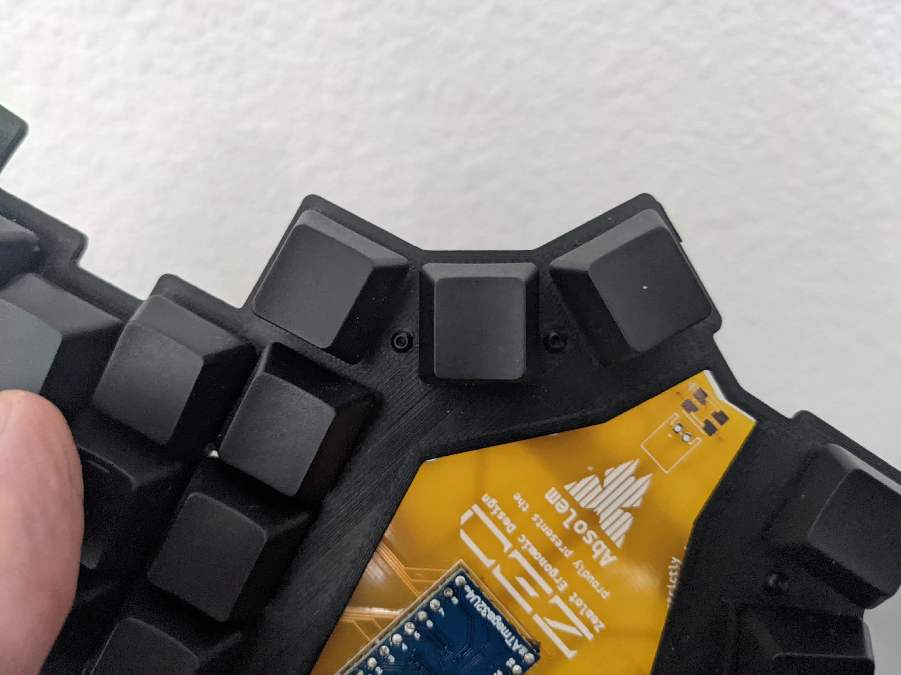
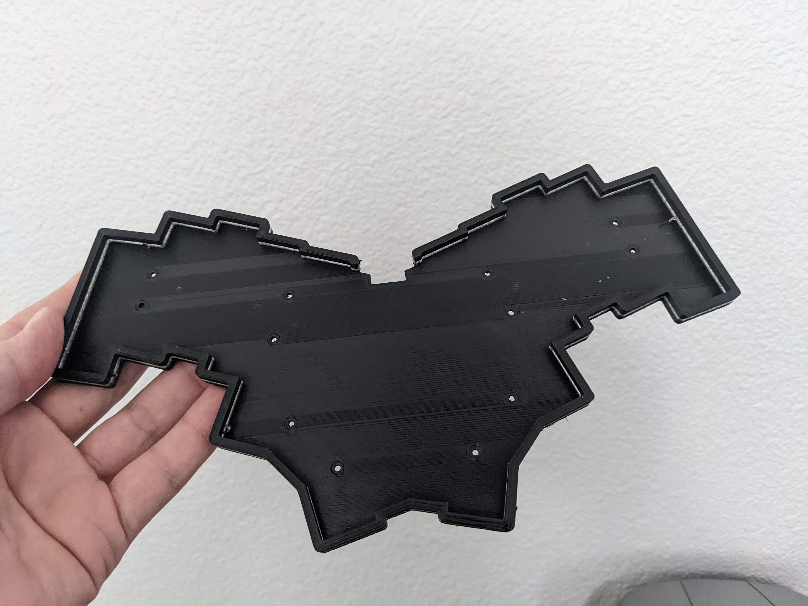

# Absolem case

Just a simple case for the Absolem. Note that this is MX only.

## BOM
* 4mm M2 screws
* M2 standoffs, 6mm for the small body stl, 8-9mm for the tall body stl
* Printed case and switchplate
* Absolem pcb and all the parts required for it (diodes, switches, etc)

## Instructions

Note: If you 

* Print either the body.stl or the body-tall.stl. The only difference between the two is the height of the body. The body.stl leaves no room below the pcb, so if you want a low profile case, use this one. However, if you plan on putting LED strips under, or adding anything that requires a gap, then use body-tall.stl.
* Print the switchplate
* Solder everything onto the board except for the switches
* Place the switches into the plate in the correct directlion (corresponding to the footprint on the pcb)
* Put the M2 screws through the holes in the switchplate, and screw the standoffs into them
* Put the switchplate into the pcb with the switches
* Solder the switches. This will permanently attach the switchplate to the pcb via the switches. You can undo it, but you have to desolder the switches to do so
* Put the switchplate / pcb into the case, and screw into the standoffs from the bottom of the case. You're done!

## Pictures

